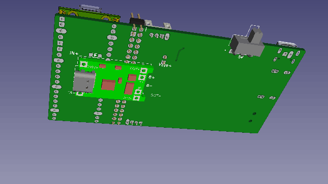
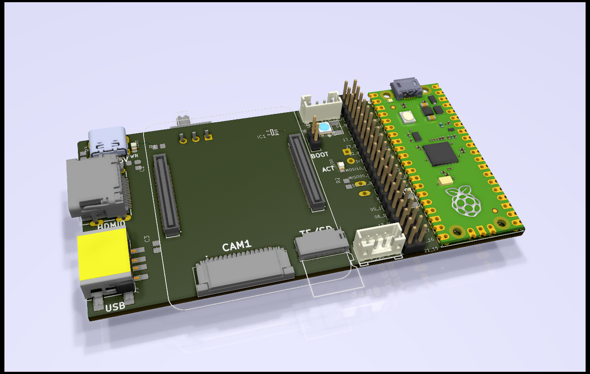
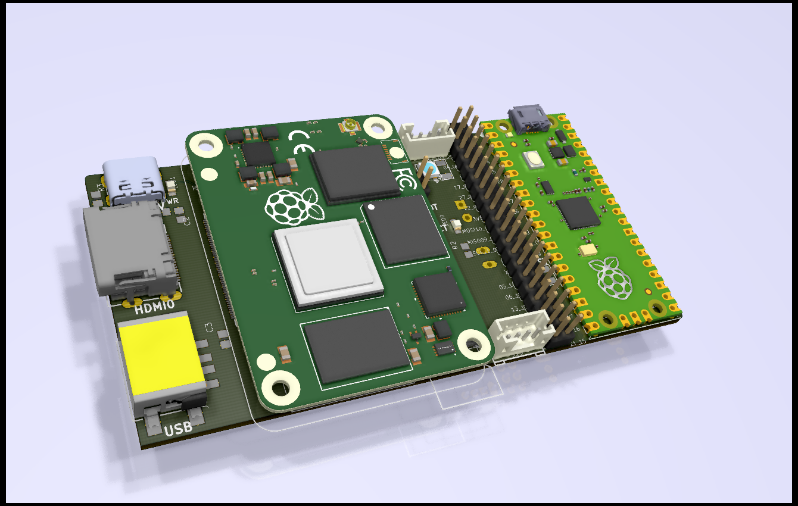

# RPi-CM4  
### Raspberry Pi CM4 Module related projects _(Work-in-Progress)_ 

 
A CM4-2layers breakout board w/ HAT-40pin and RPi-Pico.
With added features:
 - 1xTypeC 5V input (w/ slide on/off switch).
 - 1xTypeA USB2.0 connector.
 - 1xHDMI standard output.
 - 1xCSI-15pin camera interface.
 - 1xTF-card connector(w/ eMMC select jumper).
 - 1xRGB LED 3535 size.
 - 2xGrove connectors for UART/I2C.
 - 1xLiPo charger for RPi-Pico(Optional) 
    

  
 
 

 
 
 

## References  
  -[RPi_Pico](https://www.raspberrypi.org/documentation/pico/getting-started/) Pico Getting Started! 
  -[RPi CM4 Datasheet](https://datasheets.raspberrypi.org/cm4/cm4-datasheet.pdf) CM4 Datasheet. 
  -[RPi HATs](https://thepihut.com/collections/raspberry-pi-hats) thepihut.com RPi HATs. 
  -[Minimum CM4 Carrier](https://github.com/dronecz/Minimal_carrier_board_for_CM4) Minimum CM4 two-layers carrier board Eagle design. 
